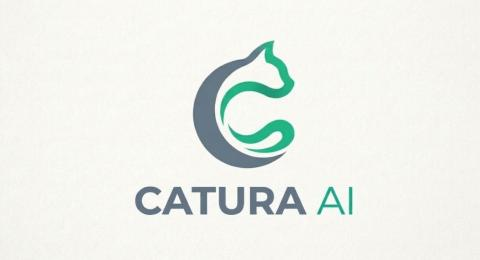

<div align="center">



# Catura AI

### A modern AI workspace for chat, web search, memory, and code generation.

<p align="center">
  
</p>

<p align="center">
  <a href="https://my-ai-assistant-9bbd.onrender.com/"></a>
  <a href="https://github.com/Anidas-crypto/Catura-AI-by-Anirban"></a>
  
</p>

</div>

---

## Overview

**Catura AI** is a modern conversational AI platform designed for fast, contextual, and productive interactions.

Built with a clean and focused interface, Catura AI combines intelligent conversation, web-assisted search, memory-aware responses, markdown rendering, and code generation in a single workspace.

The project is designed to provide a smooth user experience for developers, learners, researchers, and everyday users who need a capable AI assistant for modern workflows.

---

## Open Source

Catura AI is **fully open source**.

Anyone can:

- study the architecture
- use the source code
- modify and extend the project
- build their own AI products on top of it

Contributions, experimentation, and community improvements are welcome.

---

## Core Features

- **AI Chat** — fast conversational interaction
- **Web Search** — external knowledge access
- **Memory** — context-aware conversations
- **Markdown Support** — clean rendering of structured responses
- **Authentication / Login** — user account access
- **Code Generation** — development-oriented assistance
- **File Upload** — currently in active development

---

## Technology Stack

### Frontend
- HTML
- CSS
- JavaScript

### Backend
- Python
- FastAPI

### Database
- PostgreSQL

### AI Integration
- OpenRouter API

### Hosting
- Render

---

## Live Deployment

**Website**  
https://my-ai-assistant-9bbd.onrender.com/

**GitHub Repository**  
https://github.com/Anidas-crypto/Catura-AI-by-Anirban

---

## Local Installation

```bash
git clone https://github.com/Anidas-crypto/Catura-AI-by-Anirban.git

cd Catura-AI-by-Anirban

pip install -r requirements.txt

uvicorn main:app --reload
```

Then open your browser and visit:

```bash
http://127.0.0.1:8000
```

---

## Product Vision

Catura AI is being developed as a modern AI workspace where users can interact naturally, search the web, retain context, and generate useful output inside a minimal and elegant environment.

The long-term goal is to build an open, flexible, and extensible AI platform that developers and users can adapt to their own workflows.

---

## Screenshots

### Home Interface

_Add your screenshots here._

```md

```

---

## Current Development

Currently being improved with:

- file upload workflow
- richer contextual memory
- improved reasoning flow
- expanded developer tooling
- future voice interaction support

---

## Contributing

Contributions are welcome.

If you want to improve the platform, fix issues, or build additional capabilities:

1. Fork the repository
2. Create a new branch
3. Commit changes
4. Open a pull request

---

## License

This project is open source and available under the **Apache-2.0 license**.

---

<div align="center">

**Built by Anirban Das**

Catura AI — modern open-source conversational intelligence.

</div>
