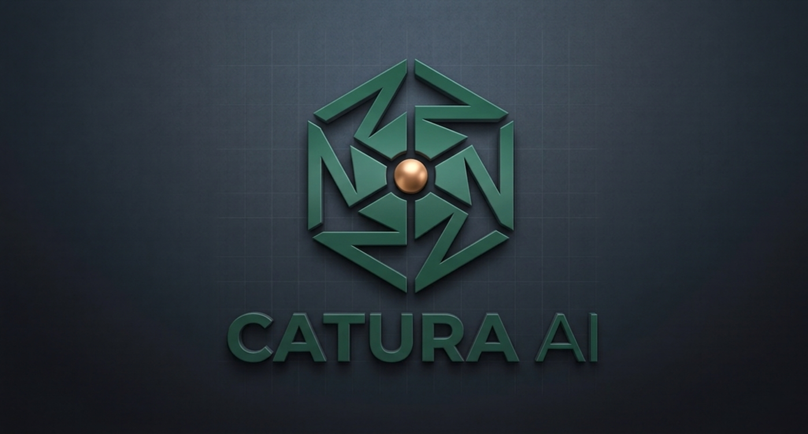

<div align="center">

[](https://catura.duckdns.org/)

[](https://catura.duckdns.org/)
[](https://github.com/Anidas-crypto/Catura-AI-by-Anirban)


# Catura AI

### A modern AI workspace for chat, web search, memory, and code generation.

<p align="center">
  
</p>

</div>

---

## 🧠 What is Catura AI?

Catura AI is not just another chatbot.

It is a **working AI environment** designed to handle real tasks — combining conversation, web search, memory, and code generation into a single system.

Instead of switching tools, everything happens in one place.

---

## ⚡ Why Catura AI?

Most AI tools:
- forget context  
- give generic answers  
- don’t integrate workflows  

**Catura AI is built differently:**

- remembers context  
- searches when needed  
- formats responses cleanly  
- assists in real development tasks  

> It behaves more like a system than a chatbot.

---

## 🔁 How it works

```
User Input
   ↓
Context Engine
   ↓
Memory + Web Search
   ↓
AI Processing (OpenRouter)
   ↓
Structured Response (Markdown / Code)
```

Everything is handled behind the scenes — so you just focus on the task.

---

## 🚀 Core Capabilities

| Capability | What it actually means |
|-----------|----------------------|
| 💬 **Smart Chat** | Context-aware conversations that don’t reset every message |
| 🌐 **Web Search** | Pulls real-time information when needed |
| 🧠 **Memory** | Keeps track of context across interactions |
| 🧾 **Markdown Output** | Clean, structured, readable responses |
| 🔐 **Authentication** | Secure user sessions |
| 💻 **Code Generation** | Practical help for developers |
| 📁 **File Upload (WIP)** | Expanding toward document-aware AI |

---

## 🌍 Live Project

| | |
|--|--|
| 🔗 **Live App** | https://catura.duckdns.org/ |
| 💻 **Repository** | https://github.com/Anidas-crypto/Catura-AI-by-Anirban |

---

## 🛠 Tech Stack

**Frontend**
- HTML, CSS, JavaScript

**Backend**
- Python (FastAPI)

**Database**
- PostgreSQL

**AI Layer**
- OpenRouter API

**Hosting**
- Render

---

## 📦 Open Source

Catura AI is fully open source.

You can:
- use the code
- modify it
- build your own AI tools
- extend features

No restrictions — build on top of it.

---

## ⚙️ Run Locally

```bash
git clone https://github.com/Anidas-crypto/Catura-AI-by-Anirban.git
cd Catura-AI-by-Anirban

pip install -r requirements.txt

uvicorn main:app --reload
```

Open:
```
http://127.0.0.1:8000
```

---

## 🧩 System Design

```
Frontend (UI)
     ↓
FastAPI Backend
     ↓
├── PostgreSQL (data)
├── Memory Layer
└── OpenRouter (AI models)
```

---

## 🔮 Future Direction

Catura AI is evolving toward:

- persistent long-term memory  
- file understanding  
- better reasoning pipelines  
- voice interaction  
- developer-focused AI tooling  

---

## 🤝 Contributing

Want to improve Catura AI?

- Fork the repo  
- Make changes  
- Submit a PR  

---

## 📜 License

Apache 2.0

---

<div align="center">

Built by **Anirban Das**

Catura AI — modern open-source conversational intelligence.

</div>
